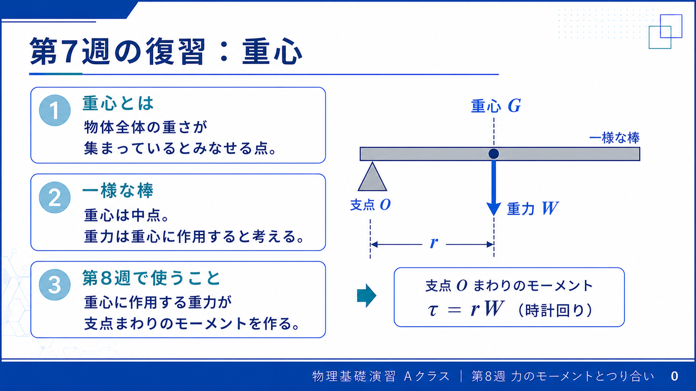
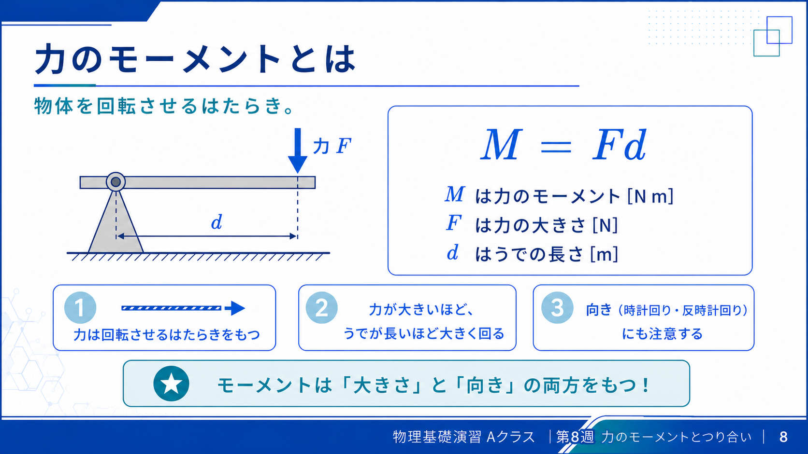
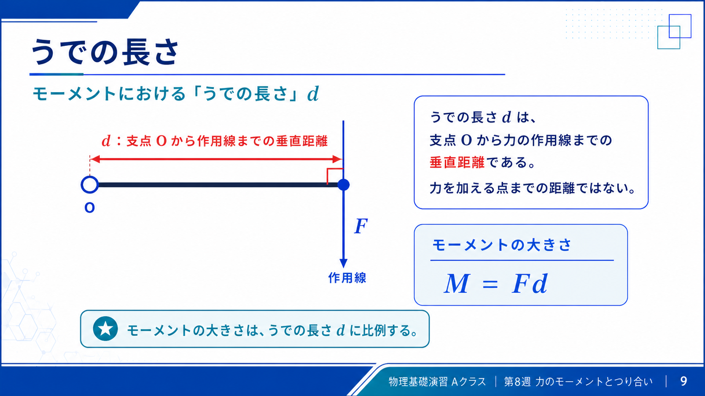
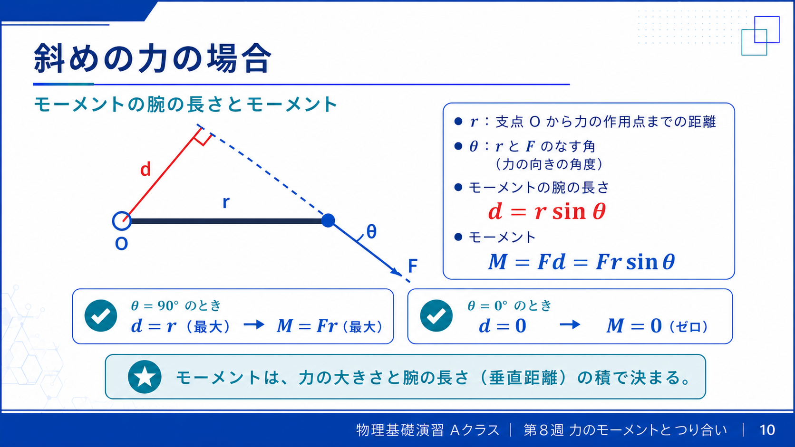
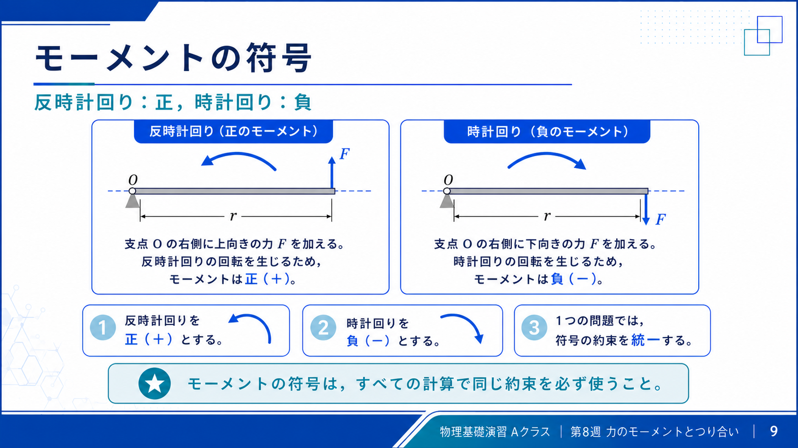
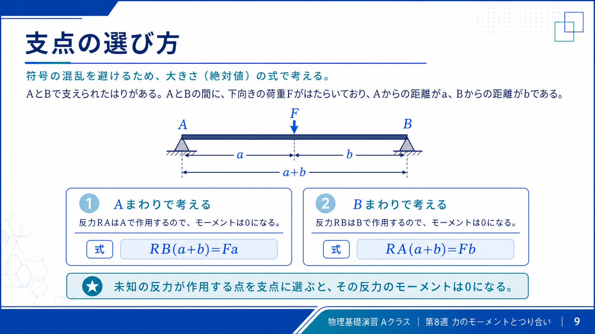
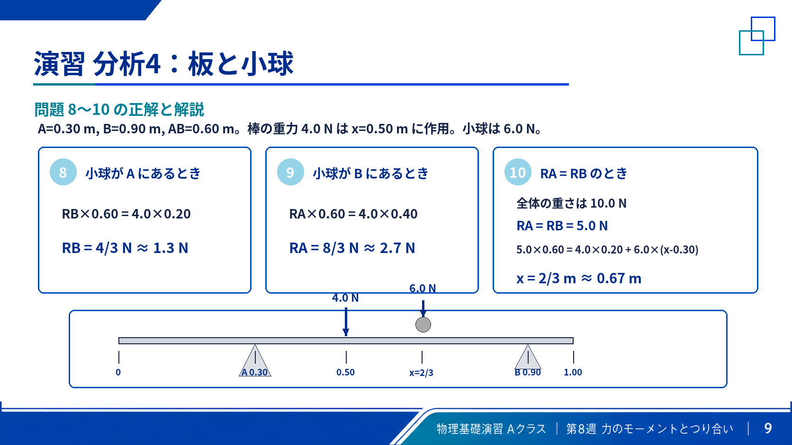

# 第8週：力のモーメントとつり合い

> ⏱️ 読了時間：約30分 | 📝 演習問題：10問 | 🎯 目標：力のモーメントを使って、剛体のつり合いを調べる

## 授業資料

::: warning 🚧 確認中
授業スライドPDFは現在確認中です。  
正式版を確認してから公開するため、いまはページ内表示を止めています。
:::

## 学習目標

この週の授業を終えると、以下のことができるようになります：

- [ ] 力のモーメントを $M=Fd$ で計算できる
- [ ] うでの長さを「支点から作用線までの垂直距離」として読める
- [ ] 斜めの力で $M=Fr\sin\theta$ を使える
- [ ] 反時計回り・時計回りの符号をそろえて式を立てられる
- [ ] 剛体のつり合い条件 $\sum F_x=0,\sum F_y=0,\sum M=0$ を使える
- [ ] 支点をうまく選んで、棒やシーソーの未知の力を求められる

---

## 1. 第7週からのつながり

第7週では、重心を「質量の平均位置」として求めました。

第8週では、重心でまとめた重さが、物体を回転させるかどうかを考えます。

<figure class="week-figure">
  
  <figcaption>第7週の重心を、棒や板に働く重力の位置として使う。</figcaption>
</figure>

::: tip つながり
棒や板の重さは、重心に働く重力として扱う。  
その重力が支点まわりに回転を起こすかを、力のモーメントで調べる。
:::

---

## 2. 力のモーメント

力のモーメントとは、物体を回転させるはたらきです。

ドアを開けるとき、蝶番の近くよりドアノブを押す方が楽です。これは、力の大きさだけでなく、支点からの距離が効くからです。

<figure class="week-figure">
  
  <figcaption>力の大きさだけでなく、支点からどれだけ離れているかが回転のしやすさを決める。</figcaption>
</figure>

$$
M=Fd
$$

| 記号 | 意味 | 単位 |
|---|---|---|
| $M$ | 力のモーメント | $\mathrm{N\,m}$ |
| $F$ | 力の大きさ | $\mathrm{N}$ |
| $d$ | うでの長さ | $\mathrm{m}$ |

---

## 3. うでの長さ

うでの長さ $d$ は、支点から力の作用線までの垂直距離です。

<figure class="week-figure">
  
  <figcaption>$d$ は作用点までの距離ではなく、支点から作用線までの垂直距離。</figcaption>
</figure>

::: warning 注意
$d$ は「支点から作用点までの距離」とは限りません。  
必ず、力の矢印を延長した作用線までの垂直距離を見る。
:::

作用線が支点を通る場合、うでの長さは0です。したがって、どれだけ大きな力でも支点まわりのモーメントは0になります。

---

## 4. 斜めの力

支点から作用点までの距離を $r$、力と棒のなす角を $\theta$ とすると、

<figure class="week-figure">
  
  <figcaption>斜めの力では、回転に効くのは作用線に対する垂直距離 $d=r\sin\theta$。</figcaption>
</figure>

$$
d=r\sin\theta
$$

したがって、

$$
M=Fr\sin\theta
$$

### 角度による違い

| 角度 | 結果 |
|---:|---|
| $\theta=90^\circ$ | $\sin90^\circ=1$ なので最大 |
| $\theta=30^\circ$ | $\sin30^\circ=0.5$ なので半分 |
| $\theta=0^\circ$ | $\sin0^\circ=0$ なのでモーメント0 |

---

## 5. モーメントの符号

この授業では、反時計回りを正、時計回りを負とします。

<figure class="week-figure">
  
  <figcaption>符号は「どちらに回そうとしているか」で決める。右側の下向き力は時計回り。</figcaption>
</figure>

$$
\text{反時計回り}=+,\qquad \text{時計回り}=-
$$

符号の決め方は逆でも構いません。ただし、1つの問題の中で途中から変えないことが重要です。

---

## 6. 剛体のつり合い条件

質点では、力の合計が0ならつり合いでした。剛体では、回転しない条件も必要です。

$$
\sum F_x=0
$$

$$
\sum F_y=0
$$

$$
\sum M=0
$$

つまり、横に動かない、縦に動かない、回転しない、という3条件です。

---

## 7. 解く手順

1. 力をすべて描く。
2. 支点を決める。
3. 各力のうでの長さを読む。
4. 反時計回りと時計回りに分ける。
5. $\sum M=0$ を立てる。
6. 必要なら $\sum F_y=0$ を使う。

::: tip 支点の選び方
未知の力が働く点を支点にすると、その力のモーメントは0になります。  
未知数が1つ消えるので、式が簡単になります。
:::

<figure class="week-figure">
  
  <figcaption>支点をAにすると $R_A$ が消え、支点をBにすると $R_B$ が消える。</figcaption>
</figure>

---

## 8. 例題

### 例題1：垂直な力

支点から $0.40\ \mathrm{m}$ の位置に、$80\ \mathrm{N}$ の力を垂直に加える。力のモーメントを求めなさい。

::: details 解答を見る
垂直なので、うでの長さは $d=0.40\ \mathrm{m}$ です。

$$
M=Fd=80\times0.40=32\ \mathrm{N\,m}
$$
:::

### 例題2：斜めの力

支点から $0.40\ \mathrm{m}$ の位置に、$80\ \mathrm{N}$ の力を $30^\circ$ の角度で加える。力のモーメントを求めなさい。

::: details 解答を見る
斜めの力なので、

$$
M=Fr\sin\theta
$$

$$
M=80\times0.40\times\sin30^\circ
=80\times0.40\times0.5
=16\ \mathrm{N\,m}
$$
:::

### 例題3：作用線が支点を通る

力の作用線が支点を通る。この力の支点まわりのモーメントはいくらか。

::: details 解答を見る
作用線が支点を通るので、うでの長さは0です。

$$
d=0
$$

$$
M=F\times0=0
$$
:::

### 例題4：つり合う距離

支点の左側 $0.80\ \mathrm{m}$ の位置に $50\ \mathrm{N}$ の力が下向きに働く。右側の距離 $x$ の位置に $20\ \mathrm{N}$ の力を下向きに働かせるとつり合った。$x$ を求めなさい。

::: details 解答を見る
左右のモーメントの大きさが等しくなります。

$$
50\times0.80=20x
$$

$$
40=20x
$$

$$
x=2.0\ \mathrm{m}
$$
:::

---

## 9. 演習問題

### 問1

支点から $0.50\ \mathrm{m}$ の位置に $60\ \mathrm{N}$ の力を垂直に加える。モーメントを求めなさい。

::: details 解答を見る
$$
M=60\times0.50=30\ \mathrm{N\,m}
$$
:::

### 問2

支点から $0.80\ \mathrm{m}$ の位置に $50\ \mathrm{N}$ の力を $30^\circ$ の角度で加える。モーメントを求めなさい。

::: details 解答を見る
$$
M=50\times0.80\times\sin30^\circ
=20\ \mathrm{N\,m}
$$
:::

### 問3

力の作用線が支点を通る。モーメントを求めなさい。

::: details 解答を見る
うでの長さが0なので、

$$
M=0
$$
:::

### 問4

左側に $50\ \mathrm{N}$ の力が $0.80\ \mathrm{m}$、右側に $20\ \mathrm{N}$ の力が距離 $x$ にある。つり合う $x$ を求めなさい。

::: details 解答を見る
$$
50\times0.80=20x
$$

$$
x=2.0\ \mathrm{m}
$$
:::

### 問5

40 kg の人が支点から $1.5\ \mathrm{m}$、30 kg の人が反対側の距離 $x$ に座る。つり合う $x$ を求めなさい。

::: details 解答を見る
重さは $mg$ なので、

$$
40g\times1.5=30g\times x
$$

$g$ は両辺にあるので消えます。

$$
x=2.0\ \mathrm{m}
$$
:::

### 問6

長さ $8.0\ \mathrm{m}$、重さ $200\ \mathrm{N}$ の一様な棒を、左端Aと左端から $6.0\ \mathrm{m}$ の点Bで支える。A, Bの反力を求めなさい。

::: details 解答を見る
Aまわりのモーメントを考える。

$$
R_B\times6.0=200\times4.0
$$

$$
R_B=133\ \mathrm{N}
$$

上下方向のつり合いより、

$$
R_A+R_B=200
$$

$$
R_A=66.7\ \mathrm{N}
$$
:::

### 問7

問6の棒で、さらにAから $2.0\ \mathrm{m}$ の位置に $100\ \mathrm{N}$ の荷重を加える。A, Bの反力を求めなさい。

::: details 解答を見る
Aまわりのモーメントを考える。

$$
R_B\times6.0=200\times4.0+100\times2.0
$$

$$
R_B=\frac{1000}{6}=167\ \mathrm{N}
$$

上下方向のつり合いより、

$$
R_A+R_B=300
$$

$$
R_A=133\ \mathrm{N}
$$
:::

### 問8

一様な棒は長さ $1.0\ \mathrm{m}$、重力 $4.0\ \mathrm{N}$ である。支点Aは左端から $0.30\ \mathrm{m}$、支点Bは左端から $0.90\ \mathrm{m}$ にある。重力 $6.0\ \mathrm{N}$ の小球がAの真上にあるとき、$R_B$ を求めなさい。

<figure class="week-figure">
  
  <figcaption>棒の重力は重心に働く。小球の位置によって、Aまわり・Bまわりの式が変わる。</figcaption>
</figure>

::: details 解答を見る
棒の重力は重心、つまり左端から $0.50\ \mathrm{m}$ の位置に働きます。Aまわりのモーメントを考えると、小球はAの真上なのでモーメントをつくりません。

$$
R_B\times(0.90-0.30)=4.0\times(0.50-0.30)
$$

$$
R_B=\frac{0.80}{0.60}=\frac{4}{3}\ \mathrm{N}
$$
:::

### 問9

問8と同じ棒で、小球がBの真上にあるとき、$R_A$ を求めなさい。

::: details 解答を見る
Bまわりのモーメントを考えると、小球はBの真上なのでモーメントをつくりません。

$$
R_A\times(0.90-0.30)=4.0\times(0.90-0.50)
$$

$$
R_A=\frac{1.60}{0.60}=\frac{8}{3}\ \mathrm{N}
$$
:::

### 問10

問8と同じ棒で、$R_A=R_B$ となるとき、小球は左端から何 $\mathrm{m}$ の位置にあるか。

::: details 解答を見る
下向きの力の合計は

$$
4.0+6.0=10.0\ \mathrm{N}
$$

なので、

$$
R_A=R_B=5.0\ \mathrm{N}
$$

Aまわりのモーメントを考える。

$$
5.0\times0.60=4.0\times(0.50-0.30)+6.0(x-0.30)
$$

$$
3.0=0.80+6.0(x-0.30)
$$

$$
x=\frac{2}{3}\ \mathrm{m}\simeq0.67\ \mathrm{m}
$$
:::

---

## 10. まとめ

::: tip 今日の要点
- 力のモーメントは $M=Fd$。
- $d$ は支点から作用線までの垂直距離。
- 斜めの力では $M=Fr\sin\theta$。
- 剛体のつり合いでは、力のつり合いに加えて $\sum M=0$ を使う。
- 支点をうまく選ぶと、未知数を減らせる。
:::

第7週では「重さがどこに働くか」を重心で考えました。第8週では、その重さや外力が「物体を回転させるか」を力のモーメントで考えます。

